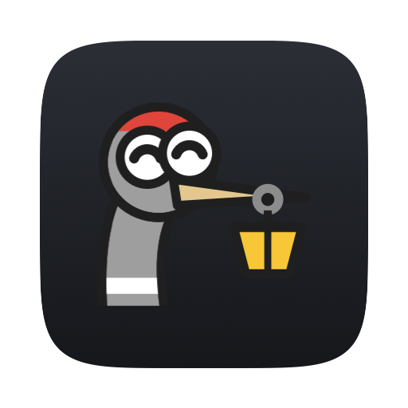

# Menu Crane

<p align="center"></p>

**Version 1.1.0** · [Changelog](https://github.com/nicholaspsmith/menu-crane/releases)

A ⌘Space launcher for macOS that does four things: open apps, do simple
arithmetic, convert units, and find emoji; an alternative to Raycast for just
those jobs. Part of
[Menumon](https://menumon.nicksmith.software), built on
[StatusItemKit](https://github.com/nicholaspsmith/StatusItemKit) and
[HotkeyKit](https://github.com/nicholaspsmith/HotkeyKit).

## Requirements

- macOS 13+
- Swift toolchain (Xcode or the Command Line Tools)
- Sibling checkouts of [StatusItemKit](https://github.com/nicholaspsmith/StatusItemKit)
  (0.9.0 or later) and [HotkeyKit](https://github.com/nicholaspsmith/HotkeyKit)
  next to this repo (`../StatusItemKit`, `../HotkeyKit`)
- No network calls at runtime. Accessibility only for ⌘↩ (handing a query to
  Spotlight types it there); everything else needs no permissions

## Using it

**⌘Space** opens the panel over the frontmost app, including a full-screen
one. Drag the panel's background to move it; it reopens where you left it, as
long as that spot is still on a connected screen. **Settings ▸ Reset Panel Position**
centres it a third of the way down the screen with your mouse.

| Key | Does |
|---|---|
| ⌘Space | Open the panel; press again to close it |
| ↑ / ↓, ⌃N / ⌃P | Move the selection |
| ↩ | Run the selected row's default action |
| ⌥↩ | Run its alternate action — reveal an app in Finder, copy a conversion with its unit |
| ⌘↩ | Search in Spotlight: close Menu Crane and type the query into the system Spotlight panel |
| ⌘1 … ⌘9 | Run that numbered row directly |
| Esc | Clear the query, then close the panel |
| ⌘W | Close the panel |
| ⌘, | Open Settings |

The Settings and Emoji Aliases windows close with ⌘W or Esc.

**Search in Spotlight.** ⌘↩ hands exactly what you typed to macOS's own
Spotlight panel (Siri's "Search or Ask" on macOS 27), for its richer, slower
results: Menu Crane closes, opens Spotlight with its shortcut (read from System
Settings ▸ Keyboard ▸ Keyboard Shortcuts ▸ Spotlight, ⌥Space if unset), and
types the query into its field. It never presses Return; you pick the result.
This posts keystrokes, so it needs Menu Crane allowed in **System Settings ▸
Privacy & Security ▸ Accessibility**. Without that, or if Spotlight's shortcut
is off or its panel doesn't appear within 3 s, the query stays in Menu Crane
with the reason in the footer.

**Hotkey.** Set your own in Settings: **Record…**, then press the shortcut (it
needs ⌘, ⌥, ⌃ or ⇧). If another app holds it, Settings shows a red warning,
the previous hotkey stays active, and the menu shows **⚠ Hotkey unavailable**;
the app retries in the background until it is free.

**Emoji.** Type `e` or `emoji` and press ↩ to open the grid, with your most
recently used emoji first. ↩ or a click copies the
selected emoji and closes the panel. ⌘K opens an inline editor to add or
remove aliases for the selected emoji; ⌘⇧S cycles the default skin tone. Esc,
or ⌫ on an empty search, or the **‹ Back** chip all return to the main list.
A query matches regardless of word order — `fingers crossed`, `crossed
fingers`, `cross fing` and `luck` all find 🤞 — and your own aliases outrank
Unicode's names.

**Math.** `+ - * /` and `x` as a synonym for `*`, with parentheses, decimals
and a leading minus. ↩ copies the bare answer.

**Conversions.** `72f to c`, `12 fl oz in pt`, `100 km/h` — temperature,
mass, volume, length, speed and acceleration. An explicit `to <unit>` always
wins. Otherwise a bare value follows the **Units** setting: **US Imperial**
(the default) converts metric values to US customary and US values with a
natural metric pairing to metric (`72f` → °C, `100 km/h` → mph); **Metric**
converts US values to metric and leaves bare metric values alone. ⌘↩ copies
the answer with its unit.

**Menu.** **Open Menu Crane** (with the current hotkey), then **Settings ▸**:
**Hotkey, Units & Emoji…** (⌘, — the Settings window), **Reset Panel
Position**, **Icon ▸** (Crane / Dot), **Start at Login** and the version; then
**Quit Menu Crane** (⌘Q).

## The menu-bar crane

<p align="center"></p>

Mendoza the crane has four states:

- **Idle** — bucket shut.
- **Searching** — the panel is open: bucket open, eyes down.
- **Grabbed** — a happy grab for about half a second after a copy or launch.
- **Miss** — puzzled, when nothing matches the query.

**Settings ▸ Icon ▸ Dot** switches to a plain dot.

## Why not a Spotlight extension?

macOS has no third-party hook for Spotlight's result list. `.mdimporter`s
only index file metadata; App Intents (Tahoe) can surface actions but cannot
render custom rows like an emoji grid or live math.

## Install

```sh
./install.sh
```

Builds `Menu Crane.app`, symlinks it into `~/Applications`, asks whether to
turn on **Start at Login**, and (re)launches it. Start at Login can be turned
off again from the Settings window or the menu's Settings ▸.

## Develop

```sh
swift build           # compile
swift test            # MenuCraneCore unit tests
./scripts/build-app.sh  # build/Menu Crane.app via StatusItemKit's make-app.sh
```

`MenuCraneCore` holds the testable logic (query parsing, matching, search,
calculator, converter, emoji and alias stores, usage ranking, panel
placement); `MenuCrane` is the app (panel, views, hotkey, settings, menu).

## Files

- `~/Library/Application Support/MenuCrane/aliases.json` — your emoji
  aliases (`{ "🤓": ["nerd"] }`); hand-editable, watched and reloaded live.
- `~/Library/Application Support/MenuCrane/usage.json` — app launch
  counts/dates and recently used emoji, used for ranking.
- Everything else (hotkey, units, skin tone, icon style) lives in
  `UserDefaults`.

## Manual checklist

- Focus returns to the previous app on close.
- The panel appears over full-screen apps.
- Esc behaves correctly in both the main list and emoji mode.
- `e` + ↩ opens the emoji grid.
- A copied emoji pastes correctly into Messages, Slack and a terminal.
- The hotkey-conflict warning appears while another app holds the shortcut.
- Drag the panel somewhere else, reopen it (⌘Space twice), and confirm it
  comes back where you left it; **menu ▸ Settings ▸ Reset Panel Position**
  re-centres it.
- Type a query, press ⌘↩: Spotlight opens with exactly that query in its
  field and nothing chosen. With Accessibility off, the footer says so and
  the query stays.
- ⌘W and Esc close the Settings and Emoji Aliases windows.
- Settings ▸ **Record…** a new hotkey and confirm it fires (and the old one
  no longer does).
- Sort a column in the Emoji Aliases window (**Edit Emoji Aliases…**).
- Check the idle vs. searching glyph reads clearly at menu-bar size.

## Updating emoji

```sh
EMOJI_VERSION=16.0 CLDR_TAG=release-46 scripts/update-emoji-data.sh
```

Downloads Unicode's `emoji-test.txt` and CLDR's English annotations for the
given (pinned) versions and rewrites `Resources/bundle/emoji.json`, which is
committed; the app never fetches it at runtime. Re-run with newer values when
Unicode ships a new version.

## Releasing

Every push to `main` is a release. Before pushing, add a dated
`## [X.Y.Z] - YYYY-MM-DD` section to the top of [`CHANGELOG.md`](CHANGELOG.md)
(minor for features, patch for fixes; turn a waiting `## [Unreleased]` into
it). When it reaches `main`, GitHub tags `vX.Y.Z` and publishes the section as
a release titled `vX.Y.Z`. Without a new version, the `pre-push` hook refuses
the push, the required `release / check` blocks the pull request, and a push
that reaches `main` anyway fails the release workflow.

The one exception is `[no release]` in the tip commit's message, for changes
nothing a user runs (setup, CI, developer docs). Never tag or create a release
by hand, and never `gh pr merge --admin` past a failing check. After merging,
`git pull` for the tag, rebuild, and update the version line at the top of
this README. `install.sh` re-arms the hook on a fresh clone. See
[StatusItemKit — Releases](https://github.com/nicholaspsmith/StatusItemKit#releases-every-push-is-one).

## License

[MIT](LICENSE)
