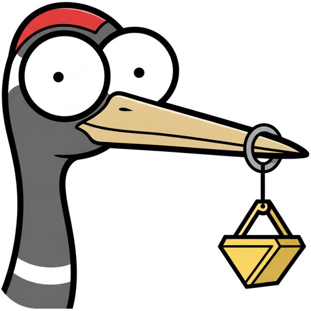

# Menu Crane

<p align="center"></p>

**Version 1.0.0** · [Changelog](https://github.com/nicholaspsmith/menu-crane/releases)

A ⌘Space launcher for macOS that does only what I used Raycast for, and
nothing else: opening apps, simple arithmetic, unit conversions and finding
emoji. Part of [Menubarn](https://widgets.nicksmith.software), built on
[StatusItemKit](https://github.com/nicholaspsmith/StatusItemKit) and
[HotkeyKit](https://github.com/nicholaspsmith/HotkeyKit).

## Using it

**⌘Space** opens the panel over whatever app is frontmost, including a
full-screen one. Drag anywhere on the panel's background to move it; it
opens where you last left it (as long as that spot is still on a connected
screen). **menu ▸ Reset Panel Position** puts it back centred a third down
on the screen with your mouse.

| Key | Does |
|---|---|
| ⌘Space | Open the panel; press again to close it |
| ↑ / ↓, ⌃N / ⌃P | Move the selection |
| ↩ | Run the selected row's default action |
| ⌘↩ | Run its alternate action — reveal an app in Finder, copy a conversion with its unit |
| ⌘1 … ⌘9 | Run that numbered row directly |
| Esc | Clear the query, then close the panel |
| ⌘, | Open Settings |

The Settings and Emoji Aliases windows close with ⌘W or Esc.

**Emoji.** Type `e` or `emoji` and press ↩ to open the grid — it always opens
fresh, with your most recently used emoji first. ↩ or a click copies the
selected emoji and closes the panel. ⌘K opens an inline editor to add or
remove aliases for the selected emoji; ⌘⇧S cycles the default skin tone. Esc,
or ⌫ on an empty search, or the **‹ Back** chip all return to the main list.
A query matches regardless of word order — `fingers crossed`, `crossed
fingers`, `cross fing` and `luck` all find 🤞 — and your own aliases outrank
Unicode's names.

**Math.** `+ - * /` and `x` as a synonym for `*`, with parentheses, decimals
and a leading minus. ↩ copies the bare answer.

**Conversions.** `72f to c`, `12 fl oz in pt`, `100 km/h` — temperature,
mass, volume, length, speed and acceleration. An explicit `to <unit>` always
wins. Otherwise a bare value follows the **Units** setting in Settings: **US
Imperial** (the default) converts a metric value to its US customary
counterpart and a US value that has a natural metric pairing to metric
(`72f` → °C, `100 km/h` → mph); **Metric** converts US values to metric and
leaves a bare metric value alone. ⌘↩ copies the answer with its unit.

## The menu-bar crane

<p align="center"></p>

Mendoza rests with his bucket shut. It opens and his eyes look down while the
panel is open and you're searching; on a copy or a launch he grabs happily
for about half a second before settling back down; and if nothing matches
the query he looks puzzled. Prefer a plain dot? **menu ▸ Icon ▸ Dot**.

## Why not a Spotlight extension?

macOS has no third-party hook for Spotlight's result list. `.mdimporter`s
only index file metadata; App Intents (Tahoe) can surface actions but cannot
render custom rows like an emoji grid or live math.

## Install

```sh
./install.sh
```

Builds `Menu Crane.app`, symlinks it into `~/Applications`, asks whether to
turn on **Start at Login**, and (re)launches it. Needs sibling checkouts of
[StatusItemKit](https://github.com/nicholaspsmith/StatusItemKit) (0.9.0 or
later) and [HotkeyKit](https://github.com/nicholaspsmith/HotkeyKit) next to
this repo (`../StatusItemKit`, `../HotkeyKit`). No permissions are needed —
v1 uses no Accessibility APIs and makes no network calls at runtime. Start at
Login can be turned off again from Settings or the menu, and you can set your
own **Hotkey** in Settings (**Record…**, then press the shortcut you want —
it needs ⌘, ⌥, ⌃ or ⇧; a red warning shows if it can't be registered).

## Files

- `~/Library/Application Support/MenuCrane/aliases.json` — your emoji
  aliases (`{ "🤓": ["nerd"] }`). Hand-editable; watched and reloaded live.
- `~/Library/Application Support/MenuCrane/usage.json` — app launch
  counts/dates and recently used emoji, used for ranking.
- Everything else (hotkey, units, skin tone, icon style) lives in
  `UserDefaults`.

## Manual checklist

- Focus returns to the previous app on close.
- The panel appears over full-screen apps.
- Esc behaves correctly in both the main list and emoji mode.
- `e` + ↩ opens the emoji grid.
- A copied emoji pastes correctly into Messages, Slack and a terminal.
- The hotkey-conflict warning appears while another app holds the shortcut.
- Drag the panel somewhere else, reopen it (⌘Space twice), and confirm it
  comes back where you left it; **menu ▸ Reset Panel Position** re-centres it.
- ⌘W and Esc close the Settings and Emoji Aliases windows.
- Settings ▸ **Record…** a new hotkey and confirm it fires (and the old one
  no longer does).
- Sort a column in the Emoji Aliases window (**Edit Emoji Aliases…**).
- Check the idle vs. searching glyph reads clearly at menu-bar size.

## Updating emoji

```sh
EMOJI_VERSION=16.0 CLDR_TAG=release-46 scripts/update-emoji-data.sh
```

Downloads Unicode's `emoji-test.txt` and CLDR's English annotations for the
given (pinned) versions and rewrites `Resources/bundle/emoji.json`, which is
committed — the app never fetches this at runtime. Re-run with newer values
when Unicode ships a new version.

## License

[MIT](LICENSE)
